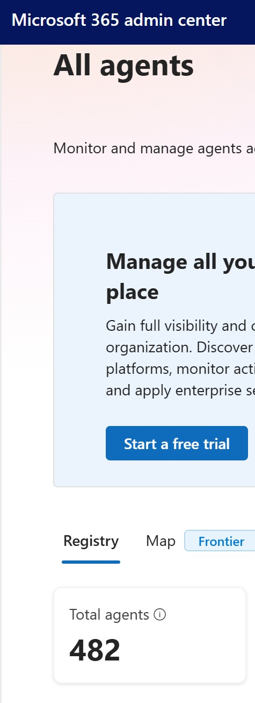
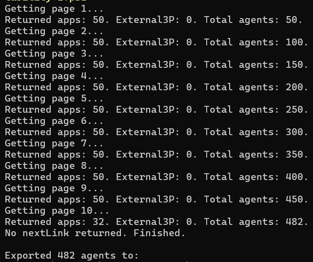
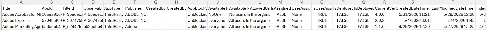

Microsoft 365 Copilot Agent Inventory

Export Microsoft 365 Copilot agent inventory and availability assignments from the Microsoft 365 Admin Center using the same internal API consumed by the admin portal.

Features
Exports all Microsoft 365 Copilot agents
Automatically follows pagination using the admin portal's nextLink token
Captures:
Agent Name
App ID
Title ID
Publisher
Created By
Availability Settings
Allowed Users and Groups
Assignment Information
Deployment Information
Version Information
Timestamps
Exports results to CSV
Requirements
Microsoft 365 Global Administrator, Copilot Administrator, or equivalent permissions
Access to the Microsoft 365 Admin Center
PowerShell 5.1 or later
Valid browser session
Setup
Open the Microsoft 365 Admin Center.

Navigate to:

Copilot > Agents > All Agents
Press F12 to open Developer Tools.
Select the Network tab.
Refresh the page.

Locate and select the request similar to:

agents?workloads=SharedAgent

In the request details, expand:

Request Headers
Find the Cookie header.
Copy the entire cookie value.

Create:

C:\Temp\cookie.txt

Paste the cookie value into the file and save.

Usage

Run:

.\Get-AgentsAvailability.ps1

The script will:

Retrieve all Copilot agents.
Follow all paging tokens automatically.
Export results to:
M365-Copilot-Agent-Availability.csv
Sample Output
Title	AvailableTo	Publisher
Sales Agent	All users in the organization can install	Microsoft
HR Assistant	Specific users/groups can install	Contoso
Project Status Report	No users in the organization can install	Fabrikam
Security Notes

This script uses an authenticated browser session cookie.

Treat the cookie like a password:

Never commit cookie.txt
Never share your cookie
Never publish exported data containing tenant information

The included .gitignore excludes common sensitive files.

Disclaimer

This script uses undocumented Microsoft 365 Admin Center APIs that are not currently published through Microsoft Graph.

## Admin Center

## Script Execution

## CSV Output

Microsoft may change or remove these endpoints at any time.

Credits

Created after reverse engineering the Microsoft 365 Admin Center agent inventory experience and identifying the portal's paging mechanism (nextLink / nextToken).
